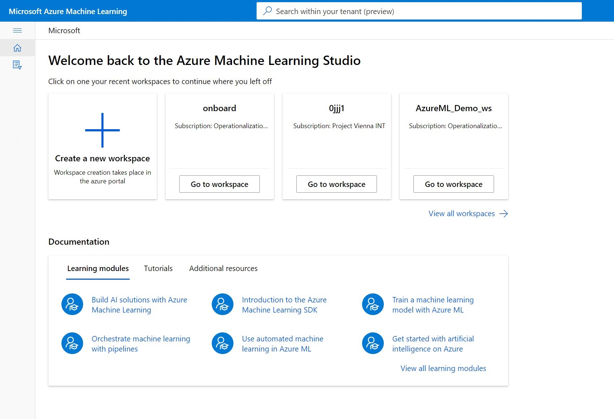

# Search for Azure Machine Learning assets across multiple workspaces

## Overview 
Azure ML users can now search for machine learning assets such as jobs, models, and components across all workspaces, resource groups, and subscriptions in their organization through a unified global view. 

## Get started 

### Global homepage 
From this centralized global view, select from recently visited workspaces or browse documentation and tutorial resources.

### Search 
Type search text into the global search bar and hit enter to trigger a search. The search result page will land on the most relevant result asset page.
The search will match the search text in all the metadata fields for the given asset. 

Change the scoep 
