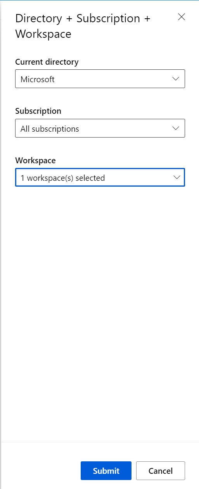
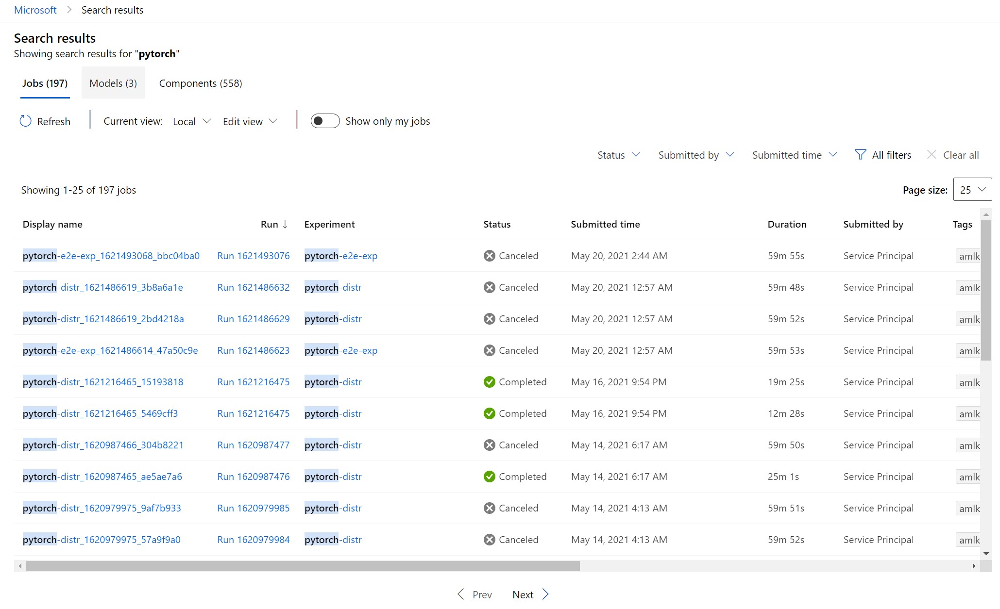

# Search for Azure Machine Learning assets across multiple workspaces (Private Preview)

## Overview 

Azure ML users can now search for machine learning assets such as jobs, models, and components across all workspaces, resource groups, and subscriptions in their organization through a unified global view. 

## Get started 

### Global homepage 

From this centralized global view, select from recently visited workspaces or browse documentation and tutorial resources.

### Search

Type search text into the global search bar and hit enter to trigger a search. The search result page will land on the most relevant result asset page.
The search will match the search text in all the metadata fields for the given asset. 

Use the asset quick links to navigate to search results for jobs, models, and components created by you. 

Change the scope of applicable subscriptions and workspaces by clicking the 'Change' link. 

### Results

Explore the Jobs, Models, and Components tabs to see all search matches. Click on an asset to be directed to the details page in the context of the relevant workspace. 

### Filters

To add more specificity to the search results, use the column filters sidebar. 

### Custom views

Customize the display of columns in the search results table. These views can be saved and shared as well. 

## Known Issues

If you have previously used this feature, a search result error may occur. Please reselect your preferred workspaces in the Directory + Subscription + Workspace tab.

