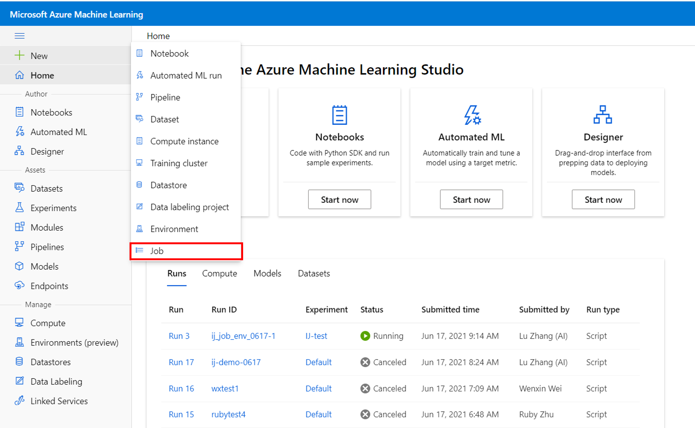
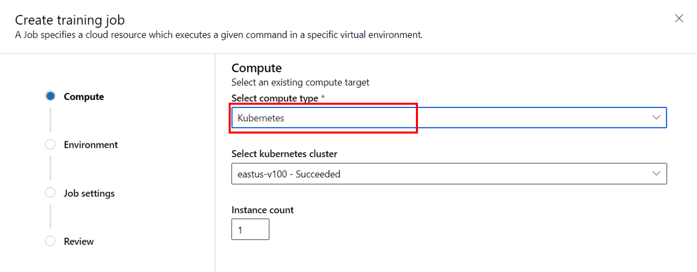
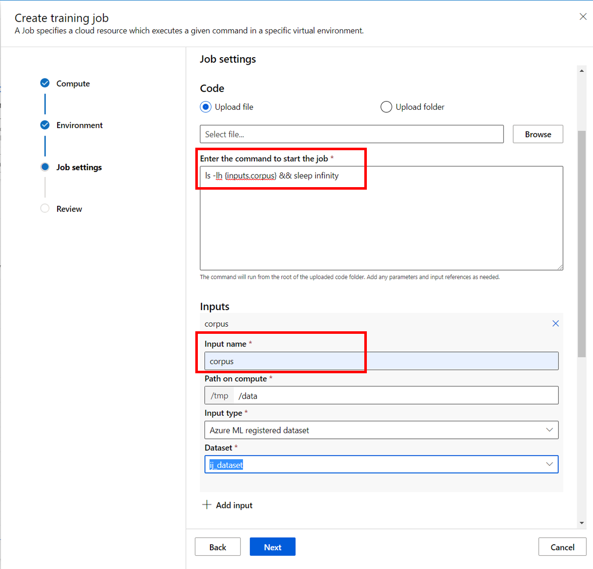
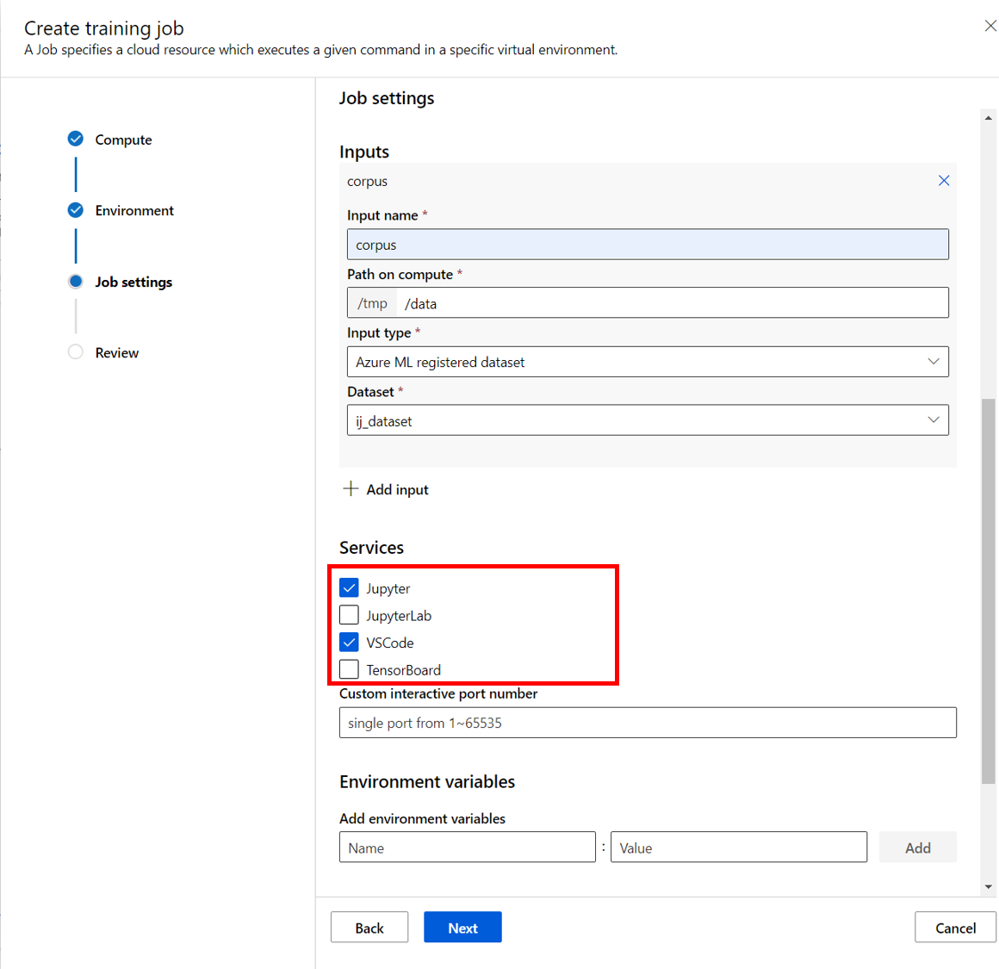
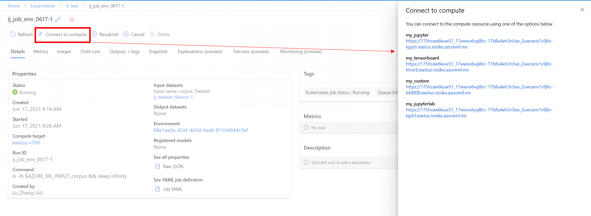
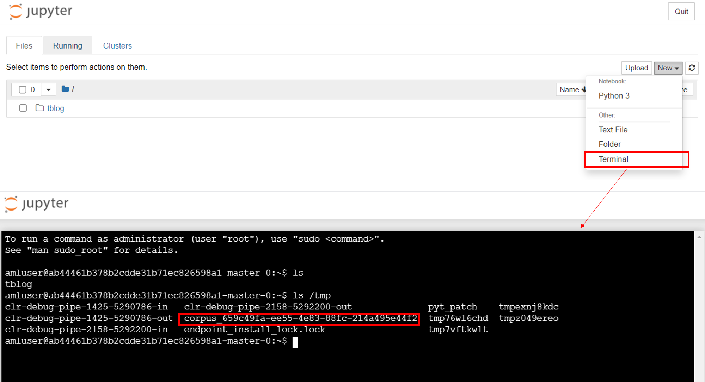
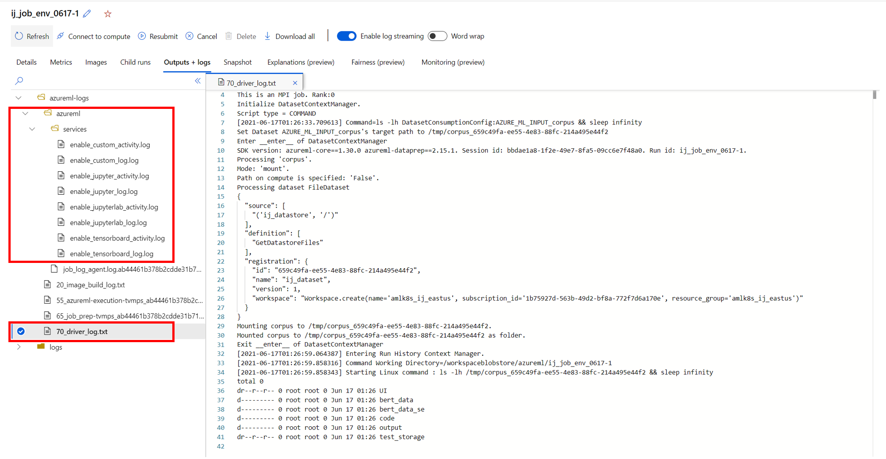

## Overview
ML model training usually requires lots of experimentation and iterations. With the new AzureML interactive job experience, data scientists can now use 2.0 CLI or the studio portal to quickly check out their required compute resources with custom environment, login to the compute target via JupyterNotebook, JupyterLab, VSCode, TensorBoard and custom endpoints to run training scripts, monitor the training progress or debug & troubleshoot the model like they usually do on their local machines, while keeping the operation cost optimized for resource allocation and utilization as a team.

Interactive job is supported on **AMLArc Compute** and will be available on AML Compute in later release.

## Prerequisites
- [Create an AzureML workspace](https://docs.microsoft.com/en-us/azure/machine-learning/how-to-manage-workspace?tabs=python) if you don't have one already.
- You have a Kubernetes cluster up and running, and learn about [Azure Arc enabled Kubernetes](https://docs.microsoft.com/en-us/azure/azure-arc/kubernetes/overview) and [cluster extension](https://docs.microsoft.com/en-us/azure/azure-arc/kubernetes/conceptual-extensions)
- Your Kubernetes cluster is [connected to Azure Arc](https://docs.microsoft.com/en-us/azure/azure-arc/kubernetes/quickstart-connect-cluster).
- You've met the pre-requisites listed under the [generic cluster extensions documentation](https://docs.microsoft.com/en-us/azure/azure-arc/kubernetes/extensions#prerequisites). Azure CLI extension k8s-extension version >=**0.4.3**.
- An Azure Arc-enabled Kubernetes cluster [is attached to AzureML workspace](https://github.com/Azure/amlarc-preview/blob/main/docs/attach-compute.md).
    - If you are running on AKS, append the following `--configuration-settings` to your original command `amloperator.enableInteractiveProxy=True amloperator.interactiveProxyPort=4443`
    - If you are on Kubernetes onprem, you need to configure `amloperator.entryPointMachineForEndpoint` as one of the machines (IP or machine name) in Kubernetes cluster.
- (Optional) [an AzureML dataset is created](https://docs.microsoft.com/en-us/azure/machine-learning/how-to-connect-data-ui) if your input data is downloaded in Azure blob. You can skip this step if you will download data after you log in to the interactive job.

## Get started
### Submit an interactive job via AzureML 2.0 CLI
1. Follow this guide to [install, set up and get familiar with the 2.0 CLI](https://docs.microsoft.com/en-us/azure/machine-learning/how-to-configure-cli).
1. Create a job yaml `job.yaml` with below content. Make sure to replace `your job name`, `your input name` and `your registered dataset name` with your own values. If you want to use custom environment, follow the examples in [this tutorial](https://docs.microsoft.com/en-us/azure/machine-learning/how-to-train-cli). 
```dotnetcli
name: <your job name> #job name needs to be updated every time you submit it
command: ls -lh {inputs.<your input name>} && sleep infinity #the first command is used to mount the dataset to job container, "sleep infinity" is put at the end to make sure the resource is reserved.
environment: azureml:AzureML-Minimal:1
compute:
  target: azureml:<your attached amlarc compute name>
inputs:
  <your input name>:
    data: azureml:<your registered dataset name:version>
    mode: mount
interaction_endpoints:
  "my_jupyter":
    type: "Jupyter"
    port: 40005
  "my_tensorboard":
    type: "TensorBoard"
    port: 40006
    properties:
      logDir: "tblog"
  "my_jupyterlab":
    type: "JupyterLab"
    port: 40007
```
3. Run command `az ml job create --workspace-name <your workspace name> --resource-group <your resource group name> --subscription <sub-id> --file <path to your job yaml file> `

### Submit an interactive job via AzureML studio portal
1. Create a new job from the left navigation pane or homepage of the studio portal (**turn on flight** by appending `&flight=jobsubmissionAMLArc` to the end of the URL).

1. Choose `Kubernetes` as the compute type and specify how many nodes you need in `Instance count`.

1. Follow the wizard to choose the environment you want to start the job.
1. In `Job settings` step, add your input dataset and reference it in your command to make sure it's mounted to your job. **Also make sure your command is ended with `sleep infinity` to reserve the resource.** An example is like below:

1. Select the services you want to interact with in the job.

1. Review and create the job. The job detail can be found under `Default` experiment.


### Connect to endpoints
1. It might take a few minutes to start the job and endpoints specified. After the job is submitted and in **Running** state, you can connect to the endpoints by finding them from the run detail page on the studio.
1. You can connect to these endpoints by clicking the links from **Connect to compute**. Please note only job owner is authorized to connect to these endpoints.

1. Open a terminal from Jupyter Notebook or Jupyter Lab and start interacting within the job container. You can find the mounted data in `/tmp` folder.
 
1. If you run into any issues, the interactive endpoint logs can be found from **azureml-logs->azureml->services** and **azureml-logs->70_driver_log.txt** under **Outputs + logs** tab.


## Contact us
Reach out to us: interactivejobsfc@microsoft.com if you have any questions or feedback.