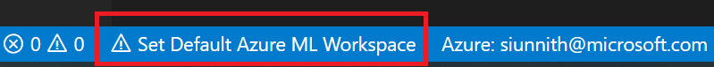
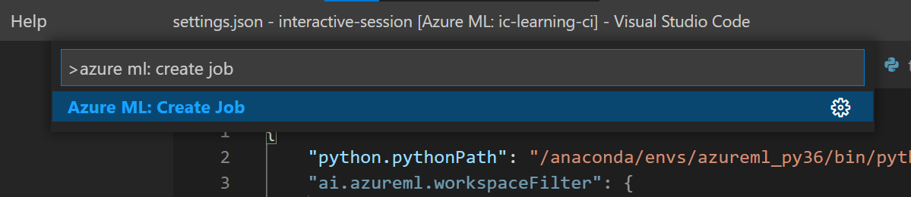
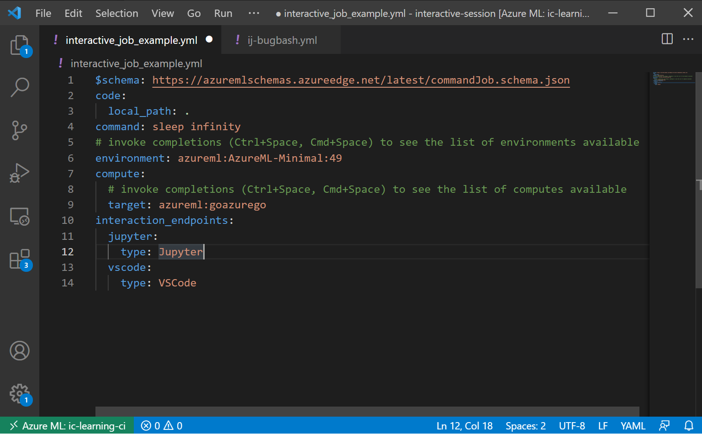
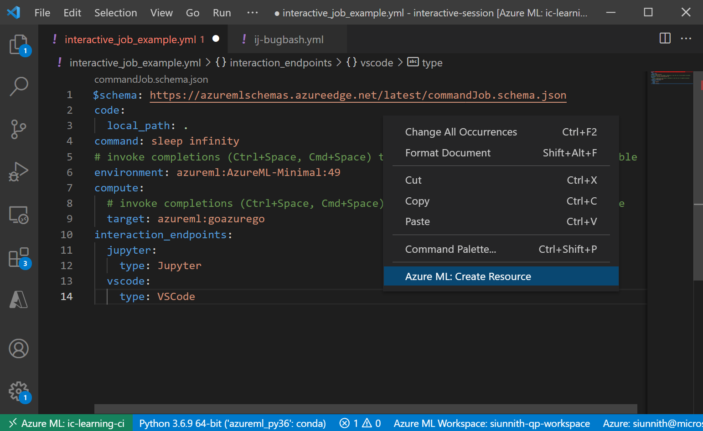
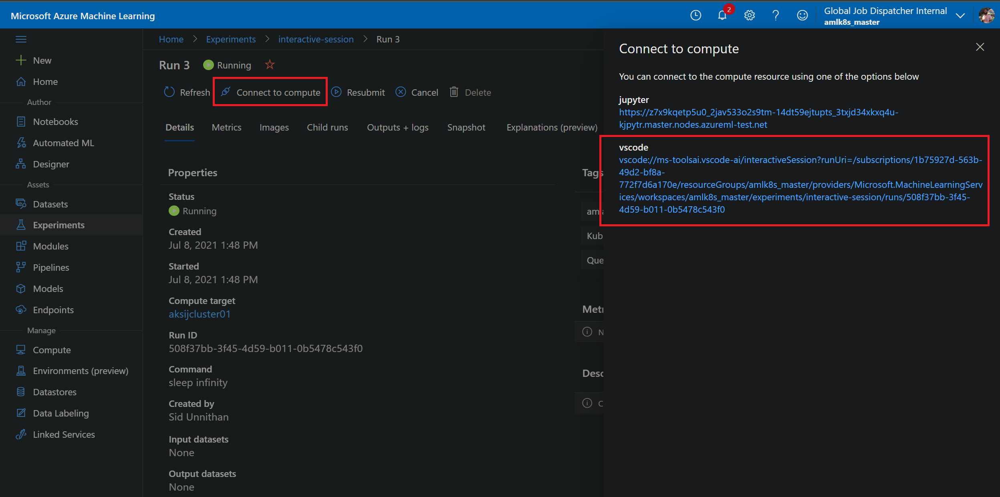
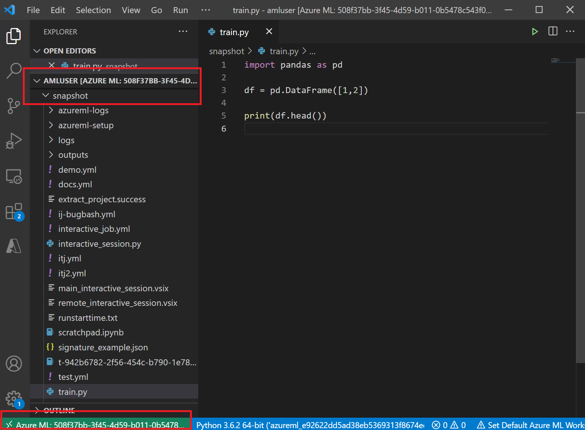

## Overview
ML model training is highly iterative and experimentational. Through VS Code and the new Azure ML interactive job experience, data scientists can quickly access a container environment on an allocated compute resource and use the Python, Jupyter, and Azure Machine Learning extensions to interactively develop and debug their model code.

Interactive job is supported on **AMLArc Compute** and will be available on AmlCompute and Compute Instances in a future release.

## Prerequisites
- Complete the **Prerequisites** and **Getting started** in [this document](https://github.com/Azure/AML-Kubernetes)
- When you deploy the AzureML extension to your Azure Arc enabled Kubernetes cluster (`az k8s-extension create`), make sure you append the configurations to turn on interactive job.
    - If you are running on AKS, append `amloperator.enableInteractiveProxy=True amloperator.interactiveProxyPort=4443` in `--configuration-settings`
    - If you are on Kubernetes onprem, you need to configure `amloperator.entryPointMachineForEndpoint` as one of the machines (IP or machine name) in Kubernetes cluster.
- (Optional) [an AzureML dataset is created](https://docs.microsoft.com/en-us/azure/machine-learning/how-to-connect-data-ui) if your input data is downloaded in Azure blob. You can skip this step if you will download data after you log in to the interactive job.

## Get started
### Submitting an interactive job from within VS Code
1. Follow this guide to [install, set up and get familiar with the 2.0 CLI](https://docs.microsoft.com/en-us/azure/machine-learning/how-to-configure-cli).
1. Install [VS Code](https://code.visualstudio.com/Download) and the [Azure Machine Learning extension](https://aka.ms/aml-ext), and sign into your Azure account.
1. Set your default workspace which should include your AmlArc Compute and Dataset resources.

1. Open the command palette (Ctrl+Shift+P on Windows, Cmd+Shift+P on OS X) and invoke the following command: "Azure ML: Create Job". This will open a job configuration template for you in the editor.

1. Edit the YAML template to include your desired code, environment, and dataset. If you'd like to use a custom environment, follow the examples in this [tutorial](https://docs.microsoft.com/en-us/azure/machine-learning/how-to-train-cli). You can invoke completions through the Azure Machine Learning extension when editing your YAML file to see a list of your compute, environment, and dataset resources.

1. Add Jupyter and VS Code interaction endpoints with ports if you wish to specify the port you want the servers to run on. Note that the VS Code port is for a websocket server used to establish a communication channel between your local VS Code client and the remote VS Code server.
1. Once you're satisfied with the state of the job YAML, right-click on the file and invoke the "Azure ML: Create Resource" command. This will open a new terminal session for you and run the appropriate Azure CLI command to submit your job.

### Using the Studio UI to connect to your interactive job
1. Use the web URL link outputted in the CLI to go to the [Azure ML Studio](https://ml.azure.com).
1. Find your recently submitted run, click on the _Connect to Compute_ option, and choose the URI listed under **vscode** to launch a remote VS Code session.
1. Wait for the Azure Machine Learning extension to complete setting up the connection between your local VS Code and the remote container. 
1. Once the connection is made, you will have access to the /home/amluser in the container which will include softlinks to your code snapshot. 

## Known Issues

### The Python and Azure Machine Learning extensions fail to load after initial connection.

This is a known issue related to the current version of VS Code (1.57). Both the Python and Azure ML extensions fail to load when first connecting to the remote container. Use the following steps to mitigate this issue:
1. Open the command palette (Ctrl + Shift + P on Windows, Cmd + Shift + P on Mac).
2. Search for "Reload Window".
3. Invoke the "Developer: Reload Window" command and wait for the connection to re-establish.

### The Python extension doesn't list the right interpreter.

Currently, a Python interpreter is not automatically set/selected in the remote container. When clicking on the "Select Interpreter" prompt in the toolbar, you may see only a "base" conda environment (/opt/miniconda/...). Although you can use this environment for your development work, it does not correspond to the conda environment packaged as part of the Azure ML environment.

Choosing the "Enter interpreter path..." option will allow you to browse the container filesystem for the right interpreter. Navigating to _/azureml-envs/azureml-\<runid>/bin/python3.6_ will lead you to the right environment to use.

## Contact Us
Reach out to us: interactivejobsfc@microsoft.com if you have any questions or feedback. For VS Code related issues please reach out to vscaiteam@microsoft.com